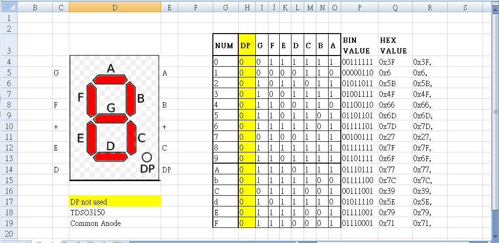
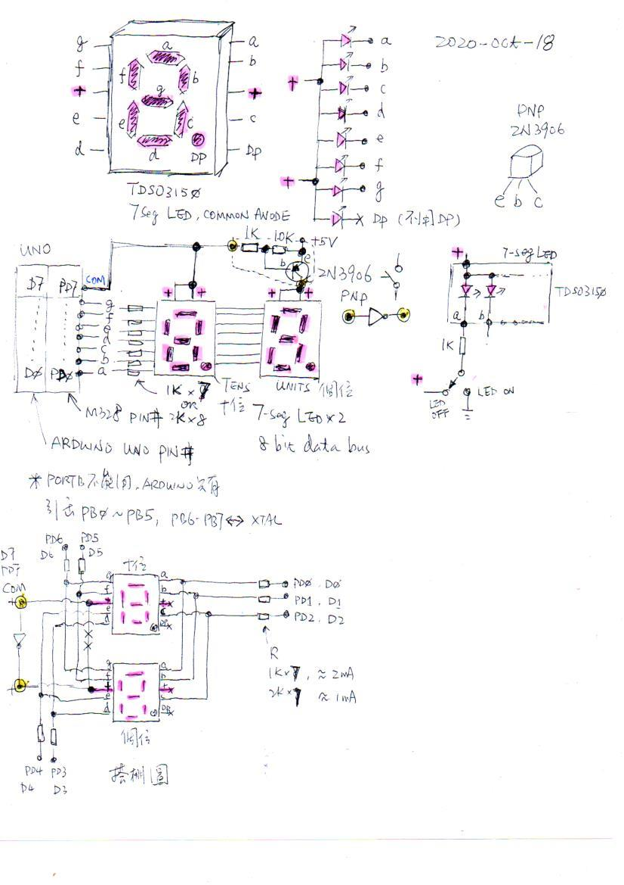

# 7segLED  

2 digits, 8 bit data bus, counter 0x00 ~ 0xFF  

### 7-seg LED used, datasheet [TDSO3150](TDSO3150.pdf),  
  

### Excel table to design map for display "0" ~ "F"  
[tool, how to design 7-seg LED lookup table to display](7segLEDmap.xlsx)  

this is the tabel coded accordingly,
```
uint8_t lookupTable[16]={0x3F,0x06,0x5B,0x4F,0x66,0x6D,0x7D,0x27,0x7F,0x6F,  // 7seg LED map for "0" ~ "9" 
                         0x77,0x7C,0x39,0x5E,0x79,0x71};                     // 7seg LED map for "A,b,C,d,E,F"
```

### circuit design  
 or PDF[schematic.pdf](schematic.pdf)  

### a simple NOT gate, an invertor, control power for LEDs, for COM  
the PNP transistor (2N3906) used as simple power switch, controlled by PD7.  
PD7, COM driver, a one single I/O pin to drive two COM of 7-seg LEDs (common anode and as power supply to the LEDs)  
PD7 = 0V, Tens+ = 0V, no power; Units+ = 5V, LED lites  
PD7 = 5V, Tens+ = 5V, LED lites; Units+ = 0V, no power  

### lites a digit, uses mapping table for segments control

DP (decemal point) is not USED, no connection.  

for example, "0", the pattern of segment mask is 0x3F, because common anode of LEDs, COM supply power (+5V) to LEDs, segment (A-F) must be pulled to 0V (GND), in order to lites LEDs, inverts 0x3F will see those segment pins to be 0V.  

the code lites first digits, and then the other,  

~lookupTable[Tens], load the patten of 0, inverts all bits.  

```
     //segmentDriver=lookupTable[Tens] + showTens;  // for common cathode
     segmentDriver=~lookupTable[Tens] + showTens;   // for common anode
     _delay_ms(200);
     
     //segmentDriver=lookupTable[Units] + showUnits; // for common cathode   
     segmentDriver=~lookupTable[Units] + showUnits;  // for common anode
```

### tesing, video clip
https://youtu.be/GjLje3UNrg0 
